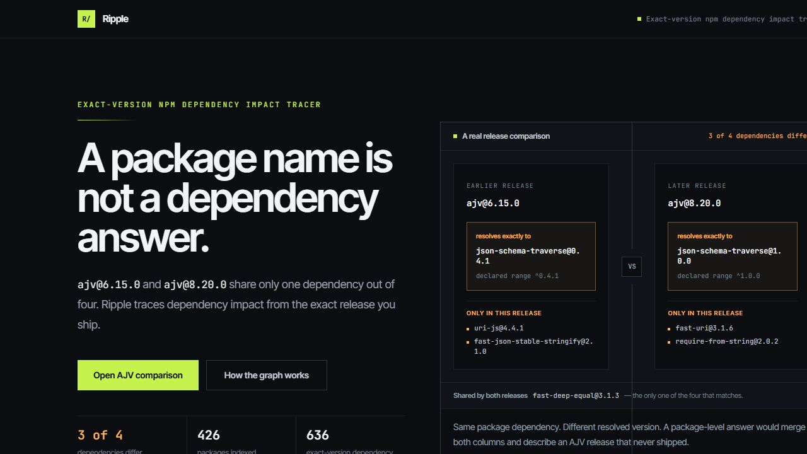
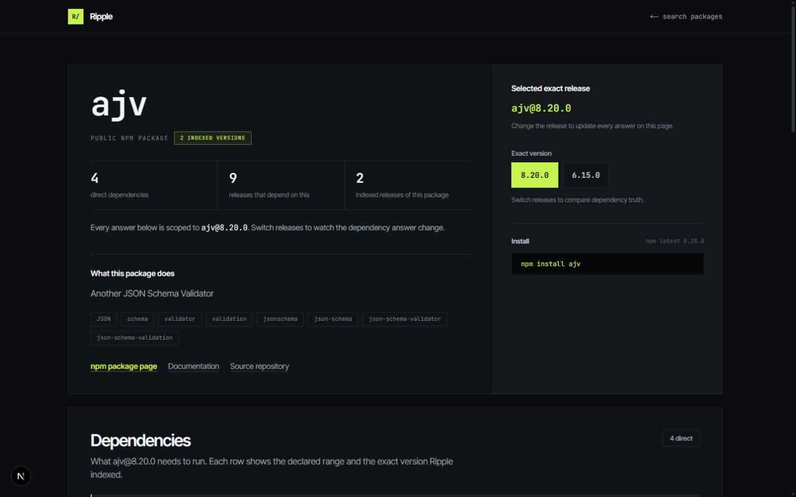
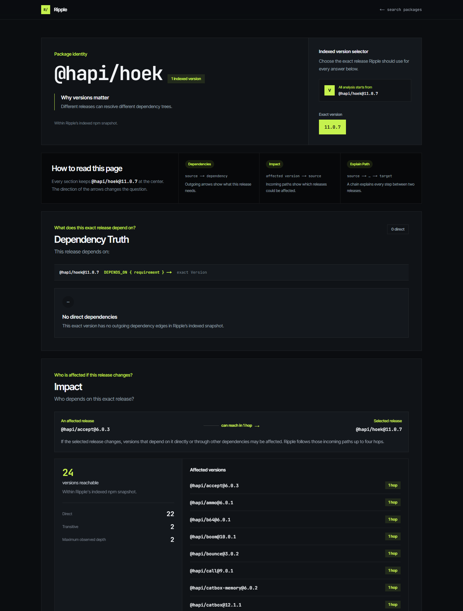

# Ripple

**Dependency answers that are true for one exact version — not averaged across a package.**

Ripple is a version-level npm dependency explorer backed by a property graph. It answers
what one published release depends on, which releases depend on it, and why — carrying the
semver requirement declared at every hop.



## The problem

Ask "what does `ajv` depend on?" and most tools answer for the *package*. There is no such
answer.

| `ajv@6.15.0` | `ajv@8.20.0` |
| --- | --- |
| `fast-deep-equal@3.1.3` — `^3.1.1` | `fast-deep-equal@3.1.3` — `^3.1.3` |
| `fast-json-stable-stringify@2.1.0` — `^2.0.0` | `fast-uri@3.1.6` — `^3.0.1` |
| **`json-schema-traverse@0.4.1`** — `^0.4.1` | **`json-schema-traverse@1.0.0`** — `^1.0.0` |
| `uri-js@4.4.1` — `^4.2.2` | `require-from-string@2.0.2` — `^2.0.2` |

Three of four dependencies differ. `json-schema-traverse` resolves to a *different exact
version of the same package*, and even the shared dependency carries a different declared
requirement.

Store dependencies on a `Package` node and these two lists have to merge. The merged node
then claims AJV depends on `json-schema-traverse` 0.4.1 **and** 1.0.0 at once, and on both
`uri-js` **and** `fast-uri`. No published release ever did. Every impact result built on
that node answers a question about a package that never shipped.

Switching releases in Ripple changes the downstream answer too: `ajv@8.20.0` is reachable
from 9 indexed versions, `ajv@6.15.0` from 1. A package-level graph reports one number for
both.

## Why Package and Version are separate

```cypher
(:Package)-[:HAS_VERSION]->(:Version)-[:DEPENDS_ON { requirement }]->(:Version)
```

`Package` is the identity and search layer. You type `ajv`, not `ajv@8.20.0`. It carries no
dependency data.

`Version` is the truth layer. Every dependency edge connects two exact releases and carries
the requirement declared for that edge. Traversal starts and ends at exact `Version.id`
values, so a result can never blend two releases.

The graph holds **0** package-level dependency edges, and `npm run graph:verify` asserts
that against the live database on every run.

## What it does

- **Package Search** — find an indexed package identity by name.
- **Dependency Explorer** — what does this exact release depend on, and under what requirement?
- **Downstream Impact** — which indexed versions can reach this one, direct and transitive, and how many hops away?
- **Explain Path** — why are these two exact versions connected?



## See it work

### Downstream impact

`@hapi/hoek@11.0.7` is reachable from **24** indexed versions — 22 direct dependents and 2
transitive, with a maximum observed depth of 2. The result describes only the graph Ripple
has indexed; it is not an ecosystem-wide blast radius.



### Explain Path

`npm run graph:verify` asserts this four-hop path against the live database:

```text
@babel/core@8.0.1
  --(^8.0.0)--> @babel/helper-compilation-targets@8.0.0
  --(^4.24.0)--> browserslist@4.28.8
  --(^1.3.0)--> update-browserslist-db@1.3.1
  --(^1.1.1)--> picocolors@1.1.1
```

Each label in parentheses is the `requirement` property stored on that edge.

## Dataset and limitations

The deterministic snapshot was resolved from 25 curated root packages at a discovery depth
of 4, and currently contains:

- **426** packages
- **449** exact versions
- **449** `HAS_VERSION` relationships
- **636** `DEPENDS_ON` relationships

**Within Ripple's indexed npm snapshot.** This is a curated, bounded dataset — not the
complete npm ecosystem.

Known gaps in the current snapshot, recorded in `scripts/data/ripple-snapshot.json`:

- **21** deps.dev graphs were rejected during ingestion and contributed no edges.
- **17** discovered versions were left unexpanded at the depth bound.
- The graph has **13** weakly connected components; the largest holds 85.3% of versions.

Every impact and path result is therefore a **lower bound**. Traversal depth is
server-controlled, so a caller cannot request an unbounded expansion. A missing dependency
or path means it was not found within Ripple's indexed data and traversal limit; it is not
a claim about all of npm.

## Graph model

Core invariants:

- `Package.name` is unique.
- `Version.id` is unique and identifies one exact release.
- Every Version has exactly one owning Package.
- `DEPENDS_ON` connects Version nodes only.
- Every dependency edge has a non-empty `requirement`.
- Exact-version questions never expand every Version belonging to a Package.

The full rationale is documented in [docs/graph-model.md](docs/graph-model.md).

## Architecture

```text
Next.js Route Handler
  → service layer
  → graph repository
  → neo4j-driver
  → CognoDB
```

- Route Handlers validate transport input with Zod and contain no Cypher.
- Services own exact-version semantics, traversal bounds, and resource errors.
- The graph repository is the only application layer containing Cypher, and maps Neo4j
  values to plain DTOs.
- A shared server-side driver instance is reused across requests.
- Ingestion and database scripts are separate from web requests.

The repository is consumed through an interface, so services are tested against an
in-memory fake with no database.

See [docs/technical-design.md](docs/technical-design.md) for the frozen P0 boundaries.

## Two sources, one boundary

Ripple reads from two places, and they answer different questions:

| Source | Answers | Scope |
| --- | --- | --- |
| CognoDB graph | dependencies, downstream impact, paths | the 426-package indexed snapshot |
| npm registry | name, description, latest version, links | all public npm packages |

The registry was added because search over a 426-package snapshot returns nothing for almost
every real query — typing `react` produced an empty result and read as a broken product, not
as a bounded one. The catalog makes the boundary visible instead of invisible: every package
carries a `graphStatus` of `indexed`, `not-indexed`, or `unavailable`, and a package outside
the snapshot gets a page that says so and explains what Ripple cannot answer for it.

**What this does not change.** The registry never contributes a dependency edge, a hop count,
or a path. Every graph answer still comes only from exact versions in the snapshot. The
registry supplies identity and description; the graph supplies dependency truth. They are
merged for display and never for traversal.

Both calls run concurrently and fail independently: a dead registry degrades to graph-only
results, a dead CognoDB degrades to catalog-only results with `graphStatus: "unavailable"`,
and only a double failure surfaces an error. All four combinations are covered by tests.

## Measured latency

The H0 spike established query compatibility, not performance. These are the first real
numbers, measured against the live instance:

```text
RETURN 1  (touches no data)          ~809 ms
count all Versions                   ~809 ms
4-hop impact traversal               ~812 ms
static page, no database             ~3 ms
```

A query that reads nothing costs the same as a four-hop traversal, so the cost is the network
round-trip to the hosted CognoDB instance, not query execution or anything in this codebase.
Each API request performs one round-trip — there is no N+1 and no per-request handshake.

This is a property of where the database lives, and it bounds what any UI here can feel like
until results are cached. No performance claim beyond these measurements is made.

## Ingestion correctness

deps.dev is the only external source used for the P0 snapshot. Ripple acquires the resolved
graph for each exact source version and applies one rule before producing canonical edges:

> Keep an edge only when its `fromNode` is the root node of that source version's own
> deps.dev graph.

Transitive edges present elsewhere in that response are not copied onto the source Version.
Their source versions are acquired separately during bounded recursive discovery, so each
Version earns its own outgoing edges from its own resolved graph.

Without this rule every path would collapse to a single hop, hop counts would be
meaningless, and Explain Path would have nothing to explain.

Bundled nodes are filtered, exact versions are deduplicated, malformed graphs are rejected
(21 in the current build), and the artifact is validated before seeding.

## Read-only API

All success and error responses use the same top-level envelope:

```json
{ "data": {}, "meta": {} }
```

Routes:

- `GET /api/packages?query=ajv`
- `GET /api/packages/{name}`
- `GET /api/versions/{versionId}`
- `GET /api/versions/{versionId}/impact`
- `GET /api/versions/{sourceVersionId}/path?target={targetVersionId}`
- `GET /api/dataset`

Errors map to `400` (invalid input), `404` (not indexed), `503` (database unavailable), and
`500` (unexpected application failure). Responses contain plain JSON DTOs only; Neo4j driver
objects never cross the repository boundary.

## Setup

Requirements: Node.js 20 or newer, npm, and access to a CognoDB instance.

```bash
npm install
cp .env.example .env.local
```

On Windows PowerShell, use `Copy-Item .env.example .env.local` instead.

Set the server-only CognoDB values in `.env.local`. Never expose them through a
`NEXT_PUBLIC_*` variable.

```dotenv
COGNODB_URI=
COGNODB_USER=
COGNODB_PASSWORD=
```

Seed and verify the deterministic snapshot, then start Ripple:

```bash
npm run graph:constraints
npm run graph:seed
npm run graph:verify
npm run dev
```

Open [http://localhost:3000](http://localhost:3000).

`npm run graph:spike` runs the historical H0 compatibility check against a namespaced
identity space and cannot touch production nodes; `npm run graph:cleanup-spike` previews and
removes only spike residue. deps.dev responses are cached under `scripts/cache/` and ignored
by Git.

## Testing

```bash
npm run lint
npm run test
npm run build
npm run graph:verify
```

`npm run test` runs 22 tests across three suites: exact-version service semantics, deps.dev
root-origin extraction and bundled-node filtering, and HTTP error mapping.

Because two independent sources now back the catalog, the search path is tested for every
combination of them failing — graph only, catalog only, both, and neither — so a dead npm
registry degrades to graph results and a dead CognoDB degrades to catalog results rather than
failing the request.

Repository record mapping and route handlers are not covered by unit tests; `graph:verify`
exercises them against the live database instead.

## Scope

P0 is complete. Authentication, vulnerability and license analysis, maintainer data, AI
features, full-ecosystem crawling, and Package-level dependency edges are intentionally out
of scope.

Package descriptions **were** out of scope in the frozen P0 design and are now shipped — see
[Two sources, one boundary](#two-sources-one-boundary) for why that changed and what it does
not change. `docs/technical-design.md` records the amendment.

The first P1 feature is Version Divergence — a direct comparison between two exact versions
of one package, which the AJV case above is the argument for.
